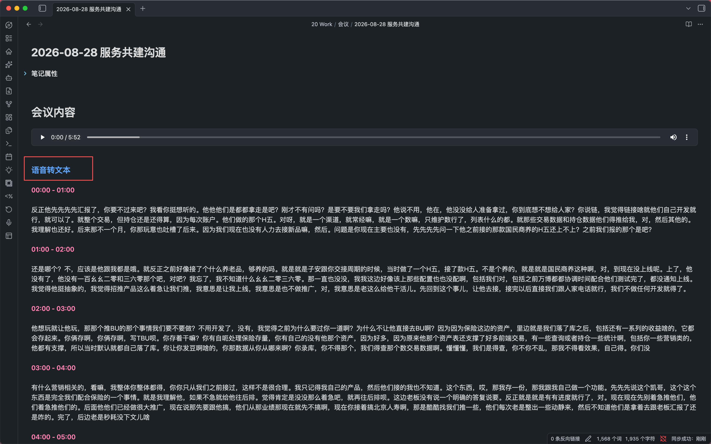

# Audio to Text

[English](README.md) | [中文](README.zh-CN.md)

Audio to Text is an Obsidian plugin that turns referenced audio files into Markdown transcripts. Select an audio reference in a note, choose the transcription command from the editor context menu, and the transcript is inserted below the reference.

## Current transcription model

The default model is **`qwen3-asr-flash-filetrans`** from Alibaba Cloud Model Studio (DashScope). The plugin submits an asynchronous file-transcription task, polls until it is complete, downloads the timestamped result, and formats it as one-minute sections.

The endpoint, model name, and recognition language are configurable in the plugin settings. The project is designed to support additional hosted providers, local models, and self-hosted gateways in the future, so the plugin name is not tied to one provider.

## Features

- Right-click an audio reference and choose **语音转文本**.
- Optional automatic transcription when an audio reference is typed, pasted, or dropped into a note.
- Supports Obsidian Wiki embeds and regular Markdown links.
- Splits the transcript into one-minute sections using returned timestamps.
- Writes standard Markdown directly below the audio reference.
- Uploads local audio to Litterbox as a temporary public download URL before submitting the asynchronous task. This also supports recordings larger than 10 MB when the upload service accepts them.
- Skips a reference when a transcript is already present below it.

## Supported references

```md
![[recording.mp3]]
![[folder/meeting.m4a]]
[[recording.wav]]
[Recording](recording.m4a)
```

## Output example

```md
![[meeting.m4a]]

### 语音转文本

**00:00 - 01:00**

Transcript for the first minute.

**01:00 - 02:00**

Transcript for the second minute.
---
```



The heading and separator follow the plugin's current Markdown output format. Existing transcripts created by older versions remain detectable for compatibility.

## Usage

1. Open **Settings → Audio to Text** and enter your DashScope API key (or the key required by your configured endpoint).
2. Confirm the endpoint and model. The defaults are the DashScope transcription endpoint and `qwen3-asr-flash-filetrans`.
3. Optionally enter a recognition language such as `zh` or `en`; leave it empty for automatic detection.
4. Set the temporary upload retention period. `24h` is recommended for asynchronous jobs.
5. Enable **自动转文字** if newly inserted audio references should start transcription automatically.
6. In a Markdown editor, select an audio reference, right-click, and choose **语音转文本**. The result is inserted below that reference.

## Privacy and security

- The API key is stored in Obsidian's local plugin data and is not written to source code or console logs. Do not commit plugin data files to a public repository.
- Before transcription, the local audio is uploaded to Litterbox and passed to the model service as a public download URL. Anyone who obtains that URL may be able to access the file until it expires.
- Do not upload highly sensitive, regulated, or confidential recordings unless your policies allow this temporary third-party upload.
- Litterbox retention, file-size limits, availability, and rate limits are controlled by the upload service. The model service has its own audio duration and request limits.

## Installation for users

End users do **not** need Node.js and should not run `npm install` or `npm run build`.

After community publication, open **Settings → Community plugins** in Obsidian, search for **Audio to Text**, then install and enable it.

Before publication, download the prebuilt `main.js` and `manifest.json` from a project Release and place them in:

```text
.obsidian/plugins/audio-to-text/
```

Reload the plugin from Obsidian's community plugin settings.

For a one-file download, use the `Audio-to-Text-<version>.zip` asset attached to the same Release. Extract the archive directly into `.obsidian/plugins/audio-to-text/` so that `main.js` and `manifest.json` are directly inside that folder. Then enable **Audio to Text** under **Settings → Community plugins**. The archive is generated automatically whenever a matching version tag is pushed.

## Local development

These commands are only for contributors who modify the source or create a development build:

```bash
npm install
npm run build
```

Use watch mode during development:

```bash
npm run dev
```

Copy the generated `main.js` and `manifest.json` into the Vault plugin directory to test them in Obsidian.

## Project structure

- `main.ts`: plugin source.
- `main.js`: bundled file loaded by Obsidian.
- `manifest.json`: Obsidian plugin manifest.
- `esbuild.config.mjs`: production build configuration.

## Contributing

Issues and pull requests are welcome. Provider integrations should keep service configuration, upload handling, request adaptation, polling, and result parsing separate. Please include coverage for different audio formats, long recordings, temporary-upload failures, and asynchronous API errors.

## Community publication status

The project is being prepared for review as an Obsidian community plugin. Its plugin ID is `audio-to-text`, which follows the community manifest requirements. Provider coverage, error handling, tests, and release documentation may continue to evolve before publication.
